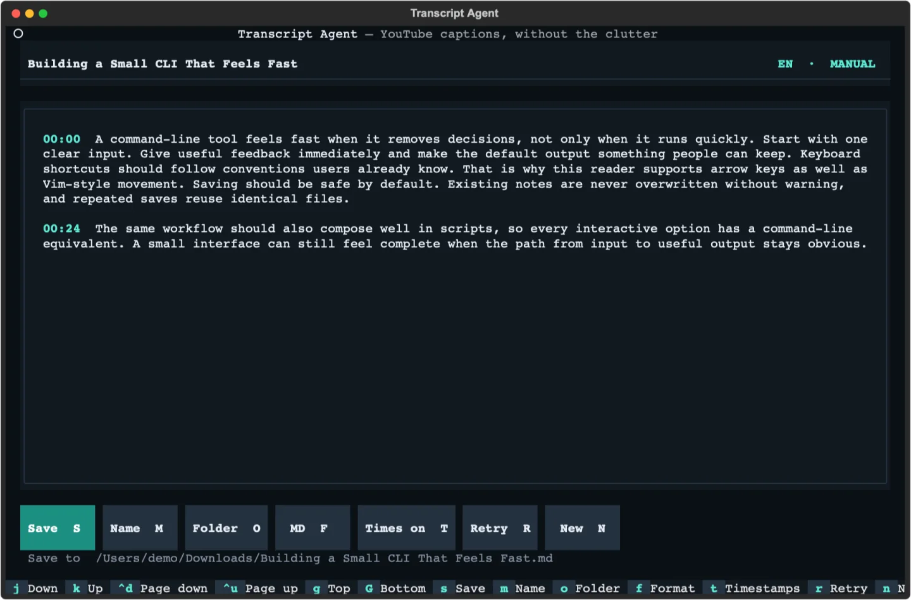
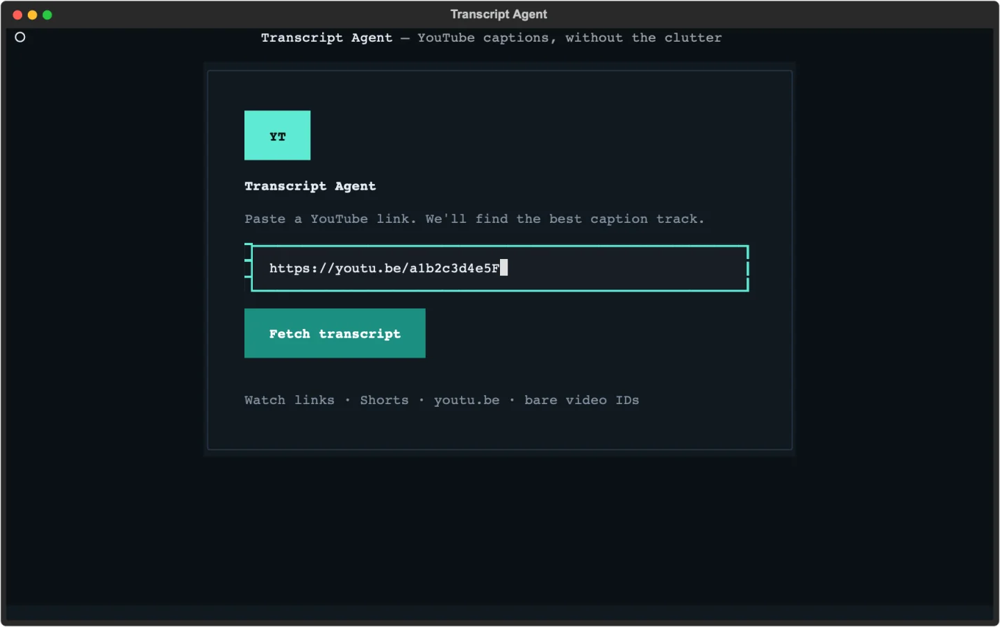

# Transcript Agent

Fetch the captions YouTube already provides, read them in a keyboard-friendly terminal UI, and save them as Markdown or plain text. No API key, audio download, or speech-to-text service needed.



## Install

Requires Python 3.10 or newer. From this repository:

```bash
uv tool install .
```

`pipx install .` and `python -m pip install .` work too.

Start the app with either command:

```bash
transcript-agent
yt-transcript
```

## Use

Paste a YouTube link into the app, or pass one when you launch it:

```bash
yt-transcript "https://www.youtube.com/watch?v=VIDEO_ID"
```



The video title becomes the filename. Transcripts go to `~/Downloads` by default, and existing files are never silently overwritten. Use `m` to rename the file or `o` to choose another folder before saving.

Regular watch URLs, `youtu.be` links, Shorts, live and embed URLs, YouTube Music links, and bare 11-character video IDs are supported.

### Keyboard shortcuts

| Key | Action |
| --- | --- |
| `j` / `k` or `↓` / `↑` | Scroll |
| `Ctrl+d` / `Ctrl+u` | Page down / up |
| `g` / `G` | Jump to top / bottom |
| `s` | Save |
| `m` | Name the file |
| `o` | Choose a folder |
| `f` | Switch between Markdown and text |
| `t` | Toggle timestamps |
| `r` | Retry the current video |
| `n` | Enter a new URL |
| `?` | Show shortcuts |
| `q` | Quit |

## Use it in scripts

Skip the UI and save immediately:

```bash
yt-transcript VIDEO_URL --no-ui
```

Common variations:

```bash
# Save plain text in a specific folder
yt-transcript VIDEO_URL --no-ui --format txt --output-dir ./notes

# Choose the filename; the extension is added automatically
yt-transcript VIDEO_URL --no-ui --name interview-notes

# Pipe a transcript to another command
yt-transcript VIDEO_URL --stdout --no-timestamps > transcript.md

# Prefer German captions, then fall back to English
yt-transcript VIDEO_URL --language de --language en
```

Run `yt-transcript --help` for every option.

## Output and caption selection

Markdown files include the video title, source URL, caption language, track type, and linked timestamps. Plain text contains the same information without Markdown syntax. Turn timestamps off for continuous prose.

Requested languages are tried in order. Without an explicit choice, Transcript Agent tries your system language, its base language, and English. Creator-provided captions take priority over auto-generated ones; if none match, the best available track is used.

Transcript Agent only reads captions available from YouTube. Videos with disabled captions, privacy or age restrictions, regional blocks, or YouTube verification checks may fail; the app keeps the session open so you can retry or enter another URL.

## Development

```bash
uv sync --extra dev
uv run pytest
uv run ruff check .
uv build
```

## License

[MIT](LICENSE)
